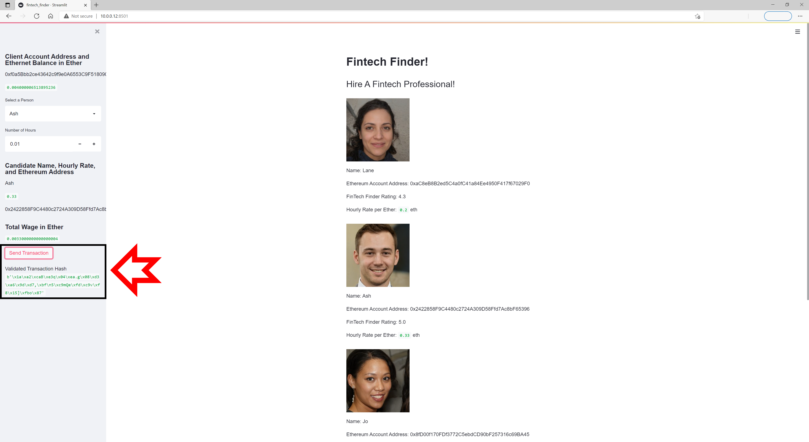
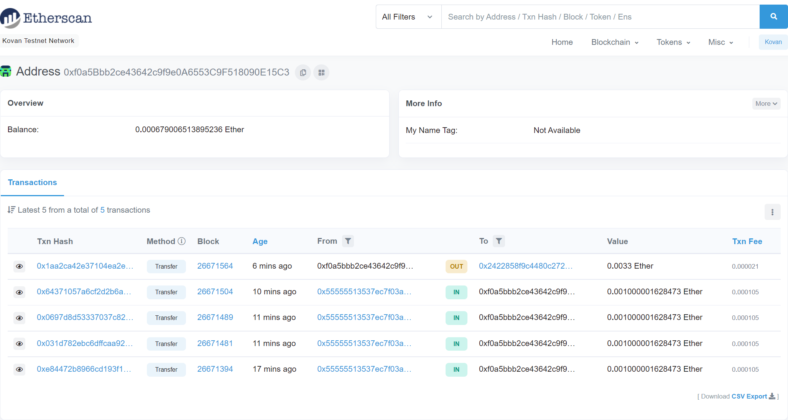
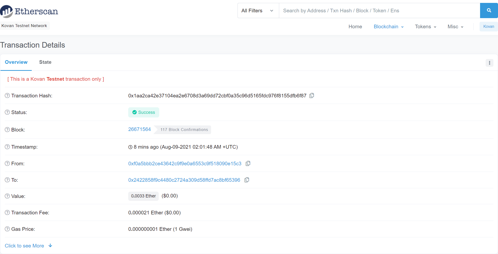
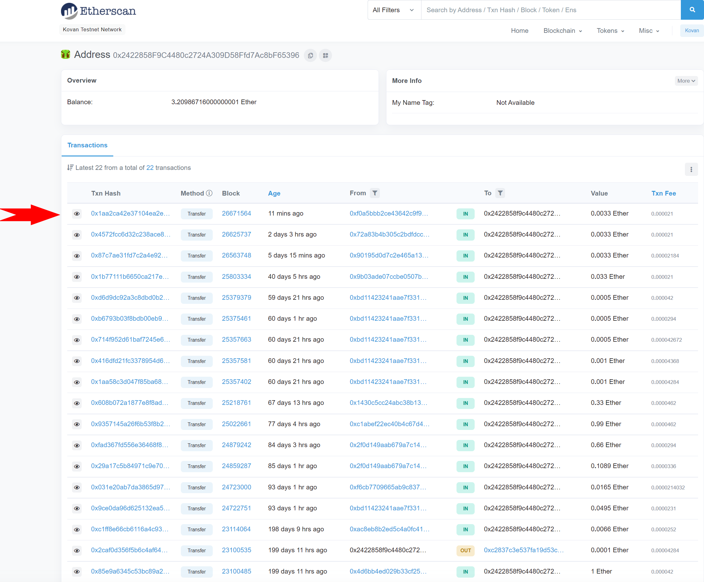

# Fintech-Finder
A Python based approach, using Streamlit interface to perform payments to contract employees and exploring the background of the transactions.

Referring to our python coding, we define basic functions such as generate_account to derive a client account for our FinTech company, get_balance to determine how much funding we have (and the limitations we have for our freelance assignment), and send_transaction for gas costs, conversion to Wei, and signing of transactions.

We create a new function, get_people, providing us some uncomplicated information about our prospective freelance employees such as their names, digital addresses, evaluation ratings and hourly wage expressed in Ethereum.

This information is then transformed using Streamlit to provide us an interactive webpage, where we can make selections and input values, all the while background operations are to pending to occur in the Ethereum network.

Deciding upon the employee that we wish to contract, we refer to the Streamlit sidebar for further information.

We use the drop-down menus to select our employee, state the number of hour(s) that we wish to hire their services for, review the information and submit the transaction / payment.

Success of this procedure results in the Validated Transaction Hash section within our sidebar.

At this point, we leave our Streamlit web application for Etherscan (https://etherscan.io/), a blockchain explorer that will allow us to inspect the background operations of the transaction.

We start off by reviewing the customer’s, FinTech company, Ethereum address to review the history of transfers of this account and the latest transfer to our employee.

Looking at the most recent transaction of the account, we can refer to the associated hash, block number, address, and value of payment.

Inspecting the TXN hash, or transaction hash/details, we can see criitical information, such as the associated hash for the payment of the FinTech company to the employee, status of the transaction, block number in the chain, time stamp, value of transaction, and associated fees. 

Lastly, we inspect the address balance of the recipient, or employee, to further ensure the payment has been successful. 

To verify this, we can ensure that the TXN hash, from address, and stated value of payment (ETH) has remained consistent.

---

## Installation Guide

Before running the analysis, the following package must be installed:

*    pip install streamlit

*    pip install eth-tester==0.5.0b3

*    pip install mnemonic

*    pip install bip44

---

## Contributors

Santiago Rosas
